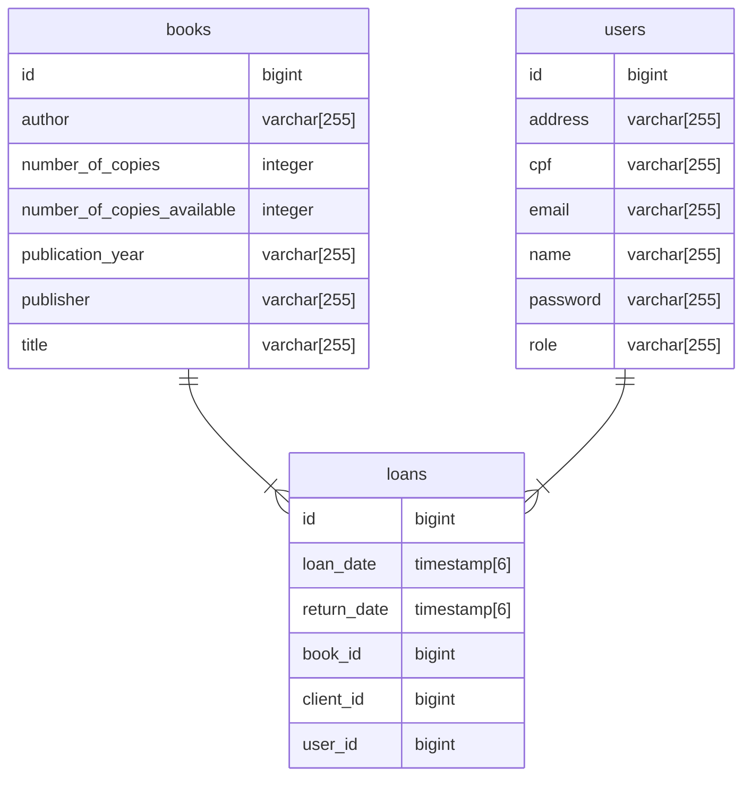

```sql
create table books (
    id bigint generated by default as identity,
    author varchar(255), number_of_copies integer,
    number_of_copies_available integer,
    publication_year varchar(255), publisher varchar(255),
    title varchar(255),
    primary key (id)
)

create table loans (
    id bigint generated by default as identity,
    loan_date timestamp(6) with time zone,
    return_date timestamp(6) with time zone,
    book_id bigint, client_id bigint,
    user_id bigint,
    primary key (id)
)

create table users (
    id bigint generated by default as identity,
    address varchar(255), cpf varchar(255),
    email varchar(255), name varchar(255),
    password varchar(255), role varchar(255),
    primary key (id)
)


alter table if exists loans add constraint FKokwvlrv6o4i4h3le3bwhe6kie foreign key (book_id) references books

alter table if exists loans add constraint FKg5dd6e6lmrlpij25baaysi3vd foreign key (client_id) references users

alter table if exists loans add constraint FK6xxlcjc0rqtn5nq28vjnx5t9d foreign key (user_id) references users
```


<h1 align="center"> Rota 1</h1>

<h2 align="center">LISTAR TODOS OS LIVROS</h2>
<p align="center">PUBLICO</p>


```http
GET 
```

```http
/api/v1/books
```

Response:

```json
{
    "id" : 2,
    "title" : "To Kill a Mockingbird",
    "author" : "Harper Lee",
    "publisher" : "J. B. Lippincott & Co.",
    "publicationYear" : "1960",
    "numberOfCopies" : 10,
    "numberOfCopuesAvailable" : 10    
}
```


<h1 align="center"> Rota 2</h1>

<h2 align="center">LISTAR LIVRO POR TITULO</h2>
<p align="center">PUBLICO</p>

```http
GET 
```

```http
/api/v1/books/find?title=To Kill a Mockingbird
```

Response:

```json
{
    "id" : 2,
    "title" : "To Kill a Mockingbird",
    "author" : "Harper Lee",
    "publisher" : "J. B. Lippincott & Co.",
    "publicationYear" : "1960",
    "numberOfCopies" : 10,
    "numberOfCopuesAvailable" : 10    
}
```


<h1 align="center"> Rota 3</h1>

<h2 align="center">DELETAR LIVRO POR ID</h2> 

<p align="center">ADMIN</p>

```http
DELETE 
```

```http
/api/v1/books/2
```

Response: 204

```http
NO_CONTENT
```


<h1 align="center"> Rota 5</h1>

<h2 align="center">CRIAR EMPRESTIMO</h2>
<p align="center"> ADMIN, FUNCIONÁRIO </p>

```http
POST 
```

```http
/api/v1/book/2/loan
```

Request:

```json
{
	"clientId" : 2,
    "returnDate" : '2023-05-30T23:59:59.00Z'
}
```


<h1 align="center"> Rota 6</h1>

<h2 align="center">CRIAR RESERVA</h2>
<p align="center"> PUBLICO</p>

```http
POST 
```

```http
/api/v1/book/2/reservation
```

Request:

```json
{
    "employeeId" : 1,
    "daysAhead" : 3,
    "returnDate" : '2023-05-30T23:59:59.00Z'
}
```


<h1 align="center"> Rota 7</h1>

<h2 align="center">DEVOLVER LIVRO</h2>
<p align="center">ADMIN, EMPLOYEE</p>

```http
GET 
```

```http
/api/v1/books/2/return
```

Response:

```json
{
    "id" : 2,
    "title" : "To Kill a Mockingbird",
    "author" : "Harper Lee",
    "publisher" : "J. B. Lippincott & Co.",
    "publicationYear" : "1960",
    "numberOfCopies" : 10,
    "numberOfCopuesAvailable" : 10    
}
```


<h1 align="center"> Rota 8</h1>

<h2 align="center">CANCELAR RESERVA</h2>
<p align="center">ADMIN, FUNCIONÁRIO</p>

```http
GET 
```

```http
/api/v1/books/2/cancel/reservation
```

Response:

```json
{
    "id" : 2,
    "title" : "To Kill a Mockingbird",
    "author" : "Harper Lee",
    "publisher" : "J. B. Lippincott & Co.",
    "publicationYear" : "1960",
    "numberOfCopies" : 10,
    "numberOfCopuesAvailable" : 10    
}
```


<h1 align="center"> Rota 9</h1>

<h2 align="center">LISTAR TODAS OS EMPRÉSTIMOS E RESERVAS</h2>
<p align="center">PUBLICO</p>

```http
GET 
```

```http
/api/v1/loans
```

Response:

```json
{
    "id" : 2,
    "book" : {
                "id" : 2,
                "title" : "To Kill a Mockingbird",
                "author" : "Harper Lee",
                "publisher" : "J. B. Lippincott & Co.",
                "publicationYear" : "1960",
                "numberOfCopies" : 10,
                "numberOfCopuesAvailable" : 9    
              },
    "clientId" : 1,
    "userId" : 1,
    "loanDate" : '2023-05-25T23:59:59.00Z',
    "returnDate" : '2023-05-30T23:59:59.00Z'
    
}
```


<h1 align="center"> Rota 10</h1>

<h2 align="center">LISTAR EMPRÉSTIMOS E RESERVAS POR ID DE CLIENTE</h2>
<p align="center">PUBLICO</p>

```http
GET 
```

```http
/api/v1/loans/find?clientId=1
```

Response:

```json
[{
    "id" : 2,
    "book" : {
                "id" : 2,
                "title" : "To Kill a Mockingbird",
                "author" : "Harper Lee",
                "publisher" : "J. B. Lippincott & Co.",
                "publicationYear" : "1960",
                "numberOfCopies" : 10,
                "numberOfCopuesAvailable" : 9    
              },
    "clientId" : 1,
    "userId" : 1,
    "loanDate" : '2023-05-25T23:59:59.00Z',
    "returnDate" : '2023-05-30T23:59:59.00Z'
    
},

{
    "id" : 2,
    "book" : {
                "id" : 2,
                "title" : "To Kill a Mockingbird",
                "author" : "Harper Lee",
                "publisher" : "J. B. Lippincott & Co.",
                "publicationYear" : "1960",
                "numberOfCopies" : 10,
                "numberOfCopuesAvailable" : 8    
              },
    "clientId" : 1,
    "userId" : 1,
    "loanDate" : '2023-05-25T23:59:59.00Z',
    "returnDate" : '2023-05-30T23:59:59.00Z'
    
}]
```


<h1 align="center"> Rota 11</h1>

<h2 align="center">LISTAR TODAS OS EMPRÉSTIMOS E RESERVAS POR DATA</h2>
<p align="center">PUBLICO</p>

```http
GET 
```

```http
/api/v1/loans/find?date=30-05-2023
```

Response:

```json
[{
    "id" : 2,
    "book" : {
                "id" : 2,
                "title" : "To Kill a Mockingbird",
                "author" : "Harper Lee",
                "publisher" : "J. B. Lippincott & Co.",
                "publicationYear" : "1960",
                "numberOfCopies" : 10,
                "numberOfCopuesAvailable" : 9    
              },
    "clientId" : 1,
    "userId" : 1,
    "loanDate" : '2023-05-25T23:59:59.00Z',
    "returnDate" : '2023-05-30T23:59:59.00Z'
    
}]
```


<h1 align="center"> Rota 12</h1>

<h2 align="center">FAZER LOGIN</h2>
<p align="center"> PUBLICO </p>

```http
POST 
```

```http
/api/v1/login
```

Request:

```json
{
	"email" : 'email@email.com',
    "password" : '123'
}
```


<h1 align="center"> Rota 13</h1>

<h2 align="center">REGISTRAR USUÁRIO</h2>
<p align="center"> ADMIN </p>

```http
POST 
```

```http
/api/v1/users
```

Request:

```json
{
    "name" : 'João do Sertão',
    "cpf" : '233.233.233-23',
	"address" : 'rua do manjericão',
    "email" : 'email@email.com',
    "password" : '123',
    "role" : 'EMPLOYEE'
}
```


<h1 align="center"> Rota 14</h1>

<h2 align="center">REGISTRAR CLIENTE</h2>
<p align="center"> PUBLICO </p>

```http
POST 
```

```http
/api/v1/users/client
```

Request:

```json
{
    "name" : 'João do Sertão',
    "cpf" : '233.233.233-23',
	"address" : 'rua do manjericão',
    "email" : 'email@email.com',
    "password" : '123'   
}
```


<h1 align="center"> Rota 15</h1>

<h2 align="center">DELETAR USUÁRIO POR ID</h2>
<p align="center"> ADMIN </p>

```http
DELETE 
```

```http
/api/v1/users/2
```

Request: 204

```HTTP
NO_CONTENT	
```


<h1 align="center"> Rota 16</h1>

<h2 align="center">LISTAR TODOS OS USUÁRIOS</h2>
<p align="center">PUBLICO</p>

```http
GET 
```

```http
/api/v1/users
```

Response:

```json
[
    {
        "id" : 1,
        "name" : 'João do Sertão',
        "cpf" : '233.233.233-23',
        "address" : 'rua do manjericão',
        "email" : 'email@email.com',
        "role" : 'EMPLOYEE'
    },
    {
        "id" : 2,
        "name" : 'Pedro Safado',
        "cpf" : '222.277.266-54',
        "address" : 'rua do pilantra',
        "email" : 'emaildiferente@email.com',
        "role" : 'CLIENT'
	}
]
```


<h1 align="center"> Rota 17</h1>

<h2 align="center">LISTAR USUÁRIO POR CPF</h2>
<p align="center">ADMIN</p>

```http
GET 
```

```http
/api/v1/users/find?cpf=222.277.266-54
```

Response:

```json
{
    "id" : 2,
    "name" : 'Pedro Safado',
    "cpf" : '222.277.266-54',
    "address" : 'rua do pilantra',
    "email" : 'emaildiferente@email.com',
    "role" : 'CLIENT'
}
```


<h1 align="center"> Rota 18</h1>

<h2 align="center">LISTAR USUÁRIO POR NOME</h2>
<p align="center">ADMIN</p>

```http
GET 
```

```http
/api/v1/users/find?nome=Pedro Safado
```

Response:

```json
{
    "id" : 2,
    "name" : 'Pedro Safado',
    "cpf" : '222.277.266-54',
    "address" : 'rua do pilantra',
    "email" : 'emaildiferente@email.com',
    "role" : 'CLIENT'
}
```


<h1 align="center"> Rota 19</h1>

<h2 align="center">LISTAR TODOS OS CLIENTES</h2>
<p align="center">PUBLICO</p>

```http
GET 
```

```http
/api/v1/users/clients
```

Response:

```json
[
    {
        "id" : 3,
        "name" : 'Oscar de José',
        "cpf" : '888.777.254-13',
        "address" : 'rua NARNIA',
        "email" : 'emailnaocompare@email.com',
        "role" : 'CLIENT'
    },
    {
        "id" : 2,
        "name" : 'Pedro Safado',
        "cpf" : '222.277.266-54',
        "address" : 'rua do pilantra',
        "email" : 'emaildiferente@email.com',
        "role" : 'CLIENT'
	}
]
```


<h1 align="center"> Rota 20</h1>

<h2 align="center">LISTAR TODOS OS FUNCIONÁRIOS</h2>
<p align="center">ADMIN, FUNCIONÁRIO</p>

```http
GET 
```

```http
/api/v1/users/emplyees
```

Response:

```json
[
    {
        "id" : 5,
        "name" : 'Robert Green',
        "cpf" : '673.237.234-23',
        "address" : 'rua nova newyork',
        "email" : 'imout@email.com',
        "role" : 'EMPLOYEE'
    },
    {
        "id" : 6,
        "name" : 'Diego Mandrake',
        "cpf" : '122.577.346-54',
        "address" : 'rua DaPilantragem',
        "email" : 'emailPerverso@email.com',
        "role" : 'EMPLOYEE'
	}
]
```

